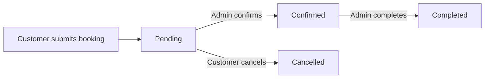
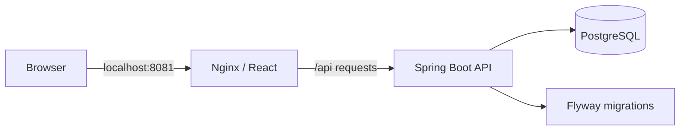

<div align="center">

# Fixly
### A little help. A happier home.

A UK home-services booking platform that brings service discovery, customer bookings, and everyday administration into one clean, responsive experience.

[](https://github.com/s180608/Fixly/actions/workflows/ci.yml)


[Features](#features) · [Architecture](#architecture) · [Quick start](#quick-start) · [Testing](#testing-and-continuous-integration)


</div>

## Overview

Fixly is a full-stack portfolio project for booking and managing home services.

Customers can explore services, choose a preferred date and time, and track their bookings. Administrators manage the service catalogue and move bookings through confirmation and completion.

The project combines a React frontend, a Spring Boot REST API, and PostgreSQL persistence. Docker Compose provides a reproducible local setup, while GitHub Actions automatically checks builds, tests, and application connectivity.

## Features

### Customer experience

- **Service discovery:** browse services with descriptions, categories, and GBP pricing.
- **Search and filtering:** find services by keyword or category.
- **Account registration and login:** access an authenticated customer experience.
- **Booking requests:** select a service, preferred date, time, and address.
- **Booking management:** view upcoming and past bookings.
- **Clear progress tracking:** distinguish pending, confirmed, completed, and cancelled bookings.
- **Cancellation:** cancel pending bookings from the customer interface.

### Administration

- **Dashboard overview:** view booking totals, pending requests, customer counts, and available services.
- **Booking management:** search and filter bookings, confirm requests, and mark confirmed bookings as completed.
- **Service catalogue:** create services with a category, description, and price, or delete services subject to backend rules.
- **Account overview:** view registered accounts and their roles.
- **Role-based access:** protect administrative pages and API operations.

### Interface and usability

- Responsive desktop and mobile layouts.
- Consistent teal and navy branding.
- Original local SVG illustrations.
- Clearly labelled forms and visible keyboard focus states.
- Loading, empty, error, and success states.
- Distinct primary, secondary, and destructive actions.
- Status labels alongside colours.
- Submission controls that reduce accidental duplicate requests.

## Service categories

<table>
  <tr>
    <td align="center">
      <br>
      <strong>Plumbing</strong>
    </td>
    <td align="center">
      <br>
      <strong>Electrical</strong>
    </td>
    <td align="center">
      <br>
      <strong>Cleaning</strong>
    </td>
  </tr>
  <tr>
    <td align="center">
      <br>
      <strong>Heating</strong>
    </td>
    <td align="center">
      <br>
      <strong>Gardening</strong>
    </td>
    <td align="center">
      <br>
      <strong>Appliance repair</strong>
    </td>
  </tr>
</table>

*These are the application’s category illustrations, not screenshots.*

## Booking lifecycle



The backend validates booking requests, including required details, past dates and times, and conflicting service bookings.

| Status | Meaning | Interface colour |
|---|---|---|
| `PENDING` | Submitted and awaiting confirmation | Amber |
| `CONFIRMED` | Confirmed by an administrator | Blue |
| `COMPLETED` | Marked as completed | Green |
| `CANCELLED` | Booking cancelled | Red |

## Technology stack

| Layer | Technologies |
|---|---|
| Frontend | React 19, Vite, React Router, CSS |
| Backend | Java 17, Spring Boot, Spring MVC |
| Authentication | Spring Security, JWT, BCrypt password hashing |
| Persistence | PostgreSQL, Spring Data JPA, Hibernate |
| Database migrations | Flyway |
| API documentation | Springdoc OpenAPI |
| Testing | JUnit, Mockito, Spring Boot Test, MockMvc |
| Frontend checks | Oxlint, Vite production build |
| Containers | Docker, Docker Compose, Nginx |
| Continuous integration | GitHub Actions |

## Architecture



In Docker, Nginx serves the production frontend and forwards `/api` requests to the backend.

Only the frontend is exposed on the host. The backend and database communicate inside the Compose network. PostgreSQL data is retained in a named volume.

## Project structure

```text
Fixly/
├── .github/workflows/       # Automated CI checks
├── .mvn/                   # Maven wrapper configuration
├── docker/                 # Container-specific application settings
├── fixly-frontend/
│   ├── public/art/         # Original local SVG artwork
│   ├── src/
│   │   ├── api/            # API request helper
│   │   ├── components/     # Shared interface and route guards
│   │   ├── pages/          # Customer and admin pages
│   │   └── utils/          # Authentication and display helpers
│   ├── Dockerfile
│   └── nginx.conf
├── scripts/                # Docker setup and smoke checks
├── src/
│   ├── main/java/          # Controllers, services, models and security
│   ├── main/resources/     # Database migrations and local configuration
│   └── test/java/          # Backend tests
├── compose.yaml
├── Dockerfile
├── DOCKER.md
└── pom.xml
```

## Quick start

### Requirements

- Git
- Docker with Docker Compose
- OpenSSL for generating local secrets

### 1. Clone the repository

```bash
git clone https://github.com/s180608/Fixly.git
cd Fixly
```

### 2. Generate local configuration

```bash
sh scripts/setup-docker.sh
```

This creates a local `.env` file with random database and JWT secrets. Existing configuration is preserved.

### 3. Build and start the application

```bash
docker compose up --build -d --wait
```

### 4. Open Fixly

Visit **http://localhost:8081**.

The initial Docker database is empty. Register an account to begin.

For administrator setup and adding your first services, follow [the Docker guide](DOCKER.md#your-data).

### Useful commands

```bash
# Check container status
docker compose ps

# Check the website and API
sh scripts/check-docker.sh

# View backend logs
docker compose logs --tail=100 backend

# Stop containers while retaining application data
docker compose down
```

> `docker compose down --volumes` deletes the Docker database volume. Use ordinary `docker compose down` to keep your data.

## Configuration and authentication

- Local `.env` files and developer database settings are excluded from Git.
- Container credentials are supplied through environment variables.
- Docker builds exclude the developer’s local `application.properties`.
- Passwords are hashed with BCrypt.
- Authenticated API requests use JWT bearer tokens.
- Backend authorization checks protect administrative operations and account ownership.
- The frontend stores its JWT in localStorage and sends it with API requests.

The Docker setup uses a separate database from any existing local development installation.

## Testing and continuous integration

GitHub Actions runs on pushes and pull requests to `main`, and can also be started manually.

### Frontend checks

- Install dependencies using `npm ci`.
- Run Oxlint.
- Build the production frontend.

### Backend and Docker checks

- Generate temporary CI configuration.
- Run the backend test suite against a separate PostgreSQL test database.
- Build and start the full Docker stack.
- Check the website and direct frontend routes.
- Verify API connectivity and unauthenticated access restrictions.
- Clean up the temporary CI containers and volumes.

**The current backend suite contains 21 tests.**

Run backend tests locally through Docker:

```bash
docker compose --profile test run --build --rm tests
docker compose --profile test stop test-db
```

Run frontend checks:

```bash
cd fixly-frontend
npm ci
npm run lint
npm run build
```

[View workflow runs →](https://github.com/s180608/Fixly/actions)

## Project scope

Fixly currently supports service discovery, customer accounts, booking management, and administration.

It does not currently include online payments, tradesperson accounts, live location tracking, or automated email/SMS notifications.

The Docker setup is intended for local use. Public deployment and HTTPS configuration are separate steps. The current GitHub Actions workflow performs continuous integration; it does not deploy the application.

## Visual assets

The home and category illustrations are stored locally as editable SVG files. The application does not depend on an external image service or paid visual assets.

See [artwork notes](fixly-frontend/public/art/README.md).

---

Built by [Chaitanya](https://github.com/s180608).
